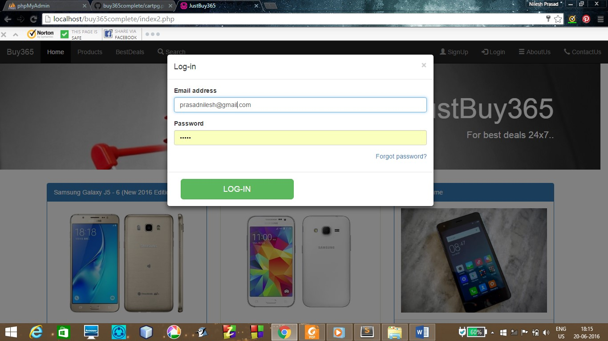

# buy365complete

This is an e-commerce website developed by me as a part of web developement training coursework.
This website is responsive on all devices and Bootstrap framework is used for designing nice looking web pages. 
Programming languages used are:
  1.HTML
  2.CSS
  3.PHP
  4.MySql database
  
  Screenshots:
  
  Index page
  
  
  Home page for logged in users
  
  
  Log-in modal
  
  
  Signup page 
  
  
  Settings page 
  
  
  Cart page 
  
  
  ContactUs page
  
  
  More features are to be added soon..
